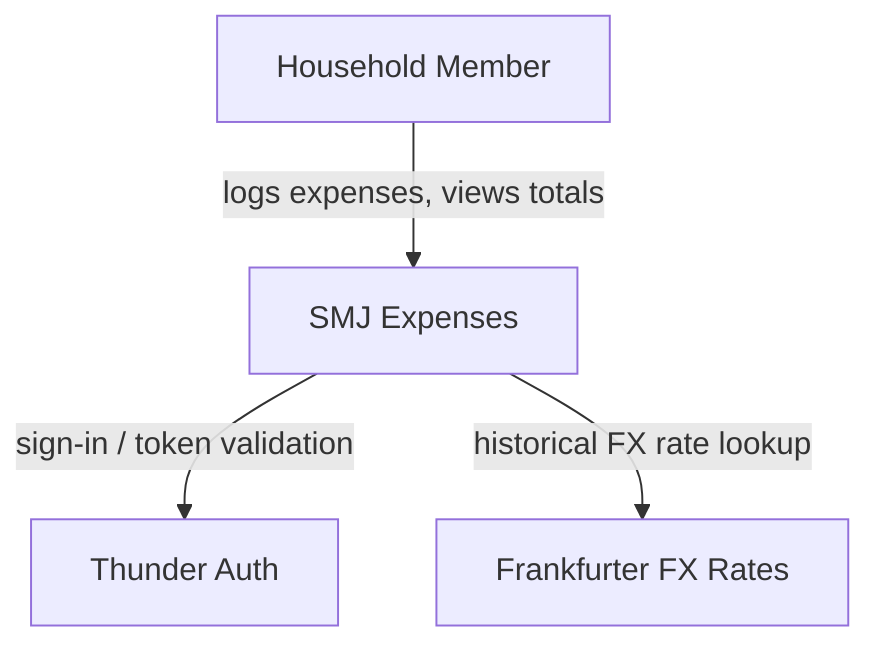
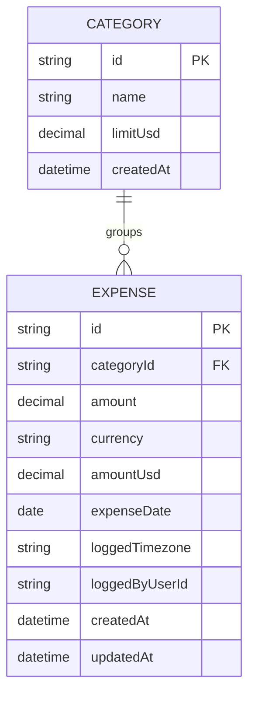
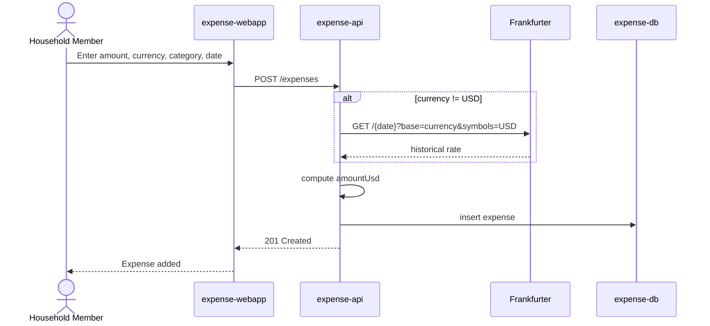
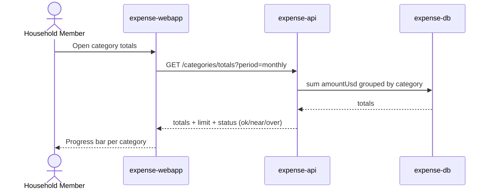

# SMJ Expenses — Design

A React SPA (`expense-webapp`) lets either household member sign in via Thunder SSO, log expenses in whatever currency they paid, and view shared totals. A Ballerina API (`expense-api`) owns the shared expense pool, categories, and limits in its own Postgres database, converting foreign-currency expenses into the household's USD base currency via the Frankfurter FX rate API using the historical rate on the date each expense was logged.

## Context (C1)

## Domain model (ER)

`amountUsd` is computed once at write time: `amount` unchanged if `currency` is already USD, otherwise converted using the Frankfurter rate for `currency` -&gt; USD on `expenseDate`. Totals and limit checks always read `amountUsd`.

## Key flows

### Log an expense while traveling

### View category totals and limit status

### View spending totals split by household member

